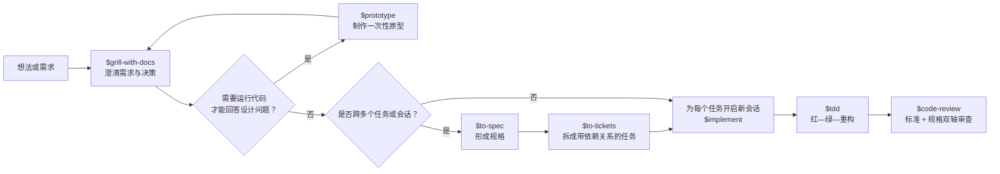

# 项目 Skill 使用指南

这份文档用于回答两个问题：

1. 在 Codex 中怎样调用 Skill？
2. 面对具体任务时，应该选择本项目的哪个 Skill 或流程？

## 1. Skill 的调用方式

### 显式调用

在提示词中使用 `$skill-name`：

```text
$tdd 为用户登录失败次数限制补充测试并实现功能
```

也可以直接说明要求：

```text
使用 tdd skill，以红—绿—重构的方式实现这个功能。
```

本项目部分上游文档仍使用 `/tdd`、`/implement` 等斜杠写法。在 Codex 中优先使用 `$tdd`、`$implement`。

### 自动匹配

没有设置 `disable-model-invocation: true` 的 Skill，可以在任务描述与其 `description` 匹配时由 Codex 自动选择。例如：

```text
诊断这个偶发失败的测试。
```

可能自动匹配 `$diagnosing-bugs`。

带有 `disable-model-invocation: true` 的 Skill 应显式调用。本项目 41 个 Skill 中有 24 个属于这一类。

### Skill 不会全部同时加载

Codex 启动任务时主要读取 Skill 的名称、描述和路径。只有选择某个 Skill 后，才会读取完整的 `SKILL.md`。因此 Skill 数量多不等于每次任务都会执行全部流程。

### 不知道选哪个时

直接调用路由 Skill：

```text
$ask-matt 我想重构检索模块，但还不确定应该先做设计、原型还是直接实现。
```

## 2. 推荐主流程：从想法到交付



使用原则：

- 需求还模糊：从 `$grill-with-docs` 开始。
- 设计问题必须“跑起来或看一眼”才能回答：短暂转入 `$prototype`。
- 单会话能完成：直接 `$implement`。
- 需要多人、多个任务或多个会话：先 `$to-spec`，再 `$to-tickets`，之后每个 ticket 单独使用 `$implement`。
- 已经有明确行为，只想测试先行：直接 `$tdd`。
- 只想审查现有改动：直接 `$code-review`。

## 3. 常见入口

### 功能开发

```text
$grill-with-docs 帮我澄清“文档检索结果重排”功能的需求。
$to-spec 把我们刚才讨论的内容整理成规格。
$to-tickets 把这个规格拆成可独立交付的 tracer-bullet tickets。
$implement 实现 .scratch/reranking/issues/01-add-reranker-interface.md。
```

### Bug 诊断

```text
$diagnosing-bugs 诊断为什么同一个检索测试有时通过、有时超时。
```

该流程适合疑难 Bug、回归、性能问题和偶发失败。简单且原因明确的问题不必强行走完整诊断流程。

### 大型且方向模糊的工作

```text
$wayfinder 规划一次跨多个会话的检索架构升级。
```

`$wayfinder` 只负责逐步消除决策迷雾，不直接实现。决策明确后回到：

```text
$to-spec → $to-tickets → $implement
```

### Issue 和 QA

```text
$qa 开始一次 QA 会话，我会逐个描述遇到的问题。
$triage 整理当前尚未评估的外部问题。
```

本项目使用本地 Markdown issue tracker：

- 规格：`.scratch/<feature>/spec.md`
- Ticket：`.scratch/<feature>/issues/<NN>-<slug>.md`
- Triage 状态：记录在 issue 文件的 `Status:` 字段中

`$triage` 用于外部进入、尚未整理的问题；不要再次 triage 由 `$to-tickets` 生成的、已经可执行的 ticket。

### 架构与领域设计

```text
$codebase-design 设计一个更深的 reranker 模块接口。
$design-an-interface 为这个模块给出几种本质不同的 API 方案。
$domain-modeling 统一 query、document、chunk、result 这些领域术语。
$improve-codebase-architecture 扫描代码库中的浅模块和错误边界。
```

- `$codebase-design` 关注模块、接口、深度、seam 和可测试性。
- `$domain-modeling` 关注业务语言、概念歧义、`CONTEXT.md` 和 ADR。
- `$design-an-interface` 用多个独立方案避免过早锁定第一个 API。
- `$improve-codebase-architecture` 用于发现架构改善机会，不是直接做大范围重构。

### 跨会话交接

```text
$handoff 为下一次 Codex 会话生成交接文档。
```

- `$handoff`：生成临时交接文档，由新的 Codex 会话继续。
- `$claude-handoff`：启动 Claude Code 后台 agent；只在明确要交给 Claude Code 时使用。
- `/compact`：Codex 内置能力，在同一任务内压缩上下文；它不是 Skill。

## 4. 项目 Skill 完整索引

### 路由、访谈与规划

| Skill | 何时使用 | 调用方式 |
| --- | --- | --- |
| `ask-matt` | 不知道应该选哪个 Skill 或流程 | 显式 |
| `grilling` | 逐个追问，压力测试计划、设计或决策 | 自动或显式 |
| `grill-me` | 没有代码库上下文时，深入澄清一个计划 | 显式 |
| `grill-with-docs` | 在代码库中澄清方案，并同步沉淀术语和 ADR | 显式 |
| `batch-grill-me` | 希望每轮一次回答当前所有前沿问题 | 显式 |
| `wayfinder` | 工作规模超过单次会话，且关键路线仍不清楚 | 显式 |
| `to-questionnaire` | 当前决策依赖另一个人的知识，需要生成问卷 | 显式 |
| `loop-me` | 设计工作区中可重复、可委托的个人工作流 | 显式 |

### 规格、实现和审查

| Skill | 何时使用 | 调用方式 |
| --- | --- | --- |
| `to-spec` | 将已经讨论清楚的内容整理成规格，不再进行访谈 | 显式 |
| `to-tickets` | 将规格拆成带阻塞关系的纵向切片 ticket | 显式 |
| `implement` | 根据规格或 ticket 实现一块明确工作 | 显式 |
| `tdd` | 功能或修复需要测试先行、红—绿—重构 | 自动或显式 |
| `code-review` | 从指定 commit、branch、tag 或 merge-base 审查改动 | 自动或显式 |
| `resolving-merge-conflicts` | 当前正处于 merge/rebase 冲突状态 | 自动或显式 |

### Bug、QA 和 Issue

| Skill | 何时使用 | 调用方式 |
| --- | --- | --- |
| `diagnosing-bugs` | 疑难 Bug、回归、性能下降、异常或不稳定测试 | 自动或显式 |
| `qa` | 交互式报告多个问题，并形成可追踪 issue | 自动或显式 |
| `triage` | 整理外部进入的 issue 或 PR，使其变得可执行 | 显式 |
| `request-refactor-plan` | 通过访谈生成小提交组成的重构计划 | 自动或显式 |

### 架构和领域模型

| Skill | 何时使用 | 调用方式 |
| --- | --- | --- |
| `codebase-design` | 设计深模块、接口、seam 和测试边界 | 自动或显式 |
| `design-an-interface` | 为同一个模块比较多个本质不同的接口方案 | 自动或显式 |
| `improve-codebase-architecture` | 扫描代码库，寻找可以“加深”的模块 | 显式 |
| `domain-modeling` | 建立领域模型、统一术语或记录架构决策 | 自动或显式 |
| `ubiquitous-language` | 从对话中提取 DDD 通用语言词汇表 | 显式 |
| `prototype` | 用一次性代码回答状态、逻辑或 UI 设计问题 | 自动或显式 |

### 研究、学习和知识管理

| Skill | 何时使用 | 调用方式 |
| --- | --- | --- |
| `research` | 基于一手资料调查问题，并留下带引用的 Markdown | 自动或显式 |
| `teach` | 在当前工作区持续学习一个概念或技能 | 显式 |
| `obsidian-vault` | 搜索、创建或整理 Obsidian 笔记 | 自动或显式 |
| `handoff` | 为下一次 Codex 会话压缩当前上下文 | 显式 |
| `claude-handoff` | 将当前工作交给新的 Claude Code 后台 agent | 显式 |

`obsidian-vault` 当前 Skill 中的默认路径是 `/mnt/d/Obsidian Vault/AI Research/`。在 macOS 上使用前应先确认或更新实际 vault 路径。

### 工程设置和专项迁移

| Skill | 何时使用 | 调用方式 |
| --- | --- | --- |
| `setup-matt-pocock-skills` | 第一次接入整套工程 Skill 时初始化 tracker、标签和领域文档 | 显式，仅一次 |
| `setup-pre-commit` | 配置 Husky、lint-staged、Prettier、类型检查和测试 | 自动或显式 |
| `setup-ts-deep-modules` | TypeScript 项目需要用 dependency-cruiser 强制深模块边界 | 显式 |
| `git-guardrails-claude-code` | 为 Claude Code 添加危险 Git 命令拦截 Hook | 自动或显式 |
| `migrate-to-shoehorn` | 测试代码要从 `as` 类型断言迁移到 `@total-typescript/shoehorn` | 自动或显式 |
| `scaffold-exercises` | 创建课程 exercise、problem、solution 和 explainer 目录 | 自动或显式 |
| `wizard` | 为第三方配置或一次性迁移生成交互式 Bash 向导 | 显式 |

`setup-matt-pocock-skills` 已在本项目执行过，通常不需要再次运行。

### 写作

| Skill | 何时使用 | 调用方式 |
| --- | --- | --- |
| `writing-fragments` | 探索素材，只收集片段，不做结构 | 显式 |
| `writing-shape` | 将已有素材逐段塑造成文章 | 显式 |
| `writing-beats` | 将素材组织成有推进感的叙事节拍 | 显式 |
| `edit-article` | 重组和精简已有文章草稿 | 显式 |
| `writing-great-skills` | 编写或评估 Skill 时使用统一设计词汇和原则 | 显式 |

推荐区分探索和成稿：

```text
$writing-fragments → $writing-shape
```

已有完整草稿时直接使用：

```text
$edit-article
```

## 5. Codex 通用和插件 Skill

这些 Skill 不属于项目工程流程，而是由 Codex 系统或已安装插件提供。通常直接描述任务即可自动匹配，也可以使用 `$名称` 显式调用。

| 类别 | 常见 Skill | 用途 |
| --- | --- | --- |
| Codex 与 OpenAI | `openai-docs` | 查询 Codex/OpenAI 官方文档和当前产品用法 |
| Skill/插件管理 | `skill-creator`、`skill-installer`、`plugin-creator` | 创建或安装 Skill、创建插件 |
| 图片 | `imagegen` | 生成或编辑位图 |
| Office 文档 | `documents`、`pdf`、`presentations`、`spreadsheets` | 创建、编辑并验证 Word、PDF、PPT、表格 |
| Excel 实时控制 | `excel-live-control` | 控制已连接的活动 Excel 工作簿 |
| 浏览器 | `control-in-app-browser`、`control-chrome`、`ego-browser` | 操作网页、登录态页面和 Web 应用 |
| 桌面应用 | `computer-use` | 操作本机 macOS 应用 UI |
| 网站 | `sites-building`、`sites-hosting` | 构建并发布网站 |
| 可视化 | `visualize` | 生成图表、交互实验或模拟器 |
| 模板 | `template-creator` | 从参考成品创建可复用的文档/演示/表格模板 Skill |

不要因为这些 Skill 可用，就在普通代码任务中主动加入图片、浏览器、网站部署或 Office 文档流程。只有任务确实需要对应产物或外部操作时才使用。

## 6. 项目约定

### Issue tracker

项目采用本地 Markdown tracker，详细规则见：

- [`docs/agents/issue-tracker.md`](docs/agents/issue-tracker.md)
- [`docs/agents/triage-labels.md`](docs/agents/triage-labels.md)

### 领域文档

探索代码前，相关 Skill 会优先读取：

- 根目录 `CONTEXT.md` 或 `CONTEXT-MAP.md`（如果存在）
- `docs/adr/` 中与当前区域相关的 ADR

详细规则见 [`docs/agents/domain.md`](docs/agents/domain.md)。

### 仓库行为约束

所有 Skill 仍受 [`AGENTS.md`](AGENTS.md) 约束。Skill 定义工作流，`AGENTS.md` 定义本仓库长期有效的行为边界；两者冲突时应遵循作用域更具体、优先级更高的指令。

## 7. 使用建议

1. 不要为了“流程完整”而串联无关 Skill。
2. 先判断当前缺少的是事实、决策、规格、实现还是验证。
3. 小而明确的任务可以直接执行，不必先 `$wayfinder` 或 `$to-spec`。
4. 多会话工作在 `$to-tickets` 后，为每个 ticket 开启干净的新任务。
5. `$prototype` 的代码默认是一次性的；保留结论，不把原型直接演化成生产实现。
6. `$research` 提供事实输入，不能代替需求决策。
7. `$code-review` 需要明确固定点，例如 `main`、某个 commit 或 merge-base。
8. 明确要用某个 Skill 时，在提示词开头直接写 `$skill-name`。

## 参考

- [OpenAI：Build skills](https://learn.chatgpt.com/docs/build-skills.md)
- [项目 Skill 路由](.agents/skills/ask-matt/SKILL.md)
- [项目 Agent 规则](AGENTS.md)
